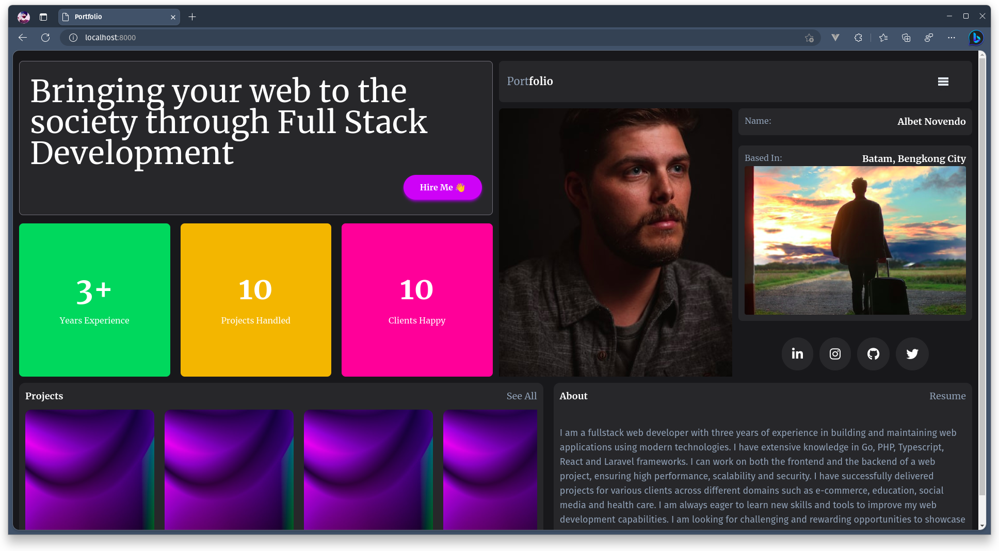
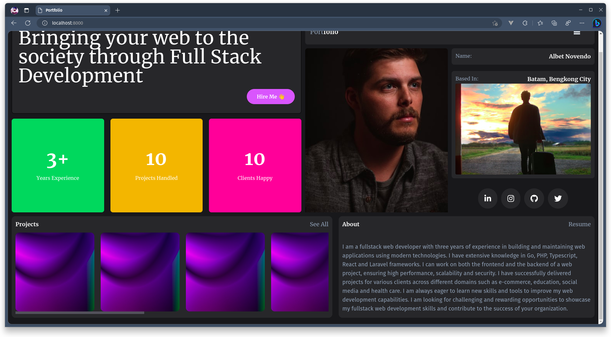
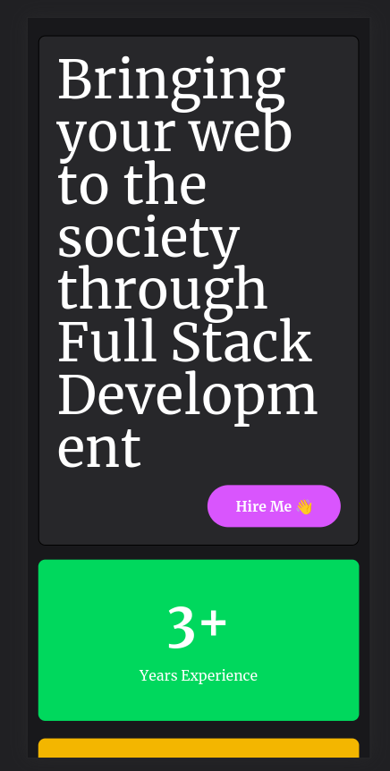
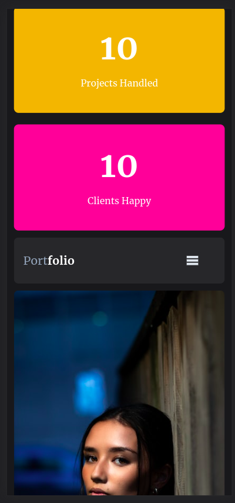
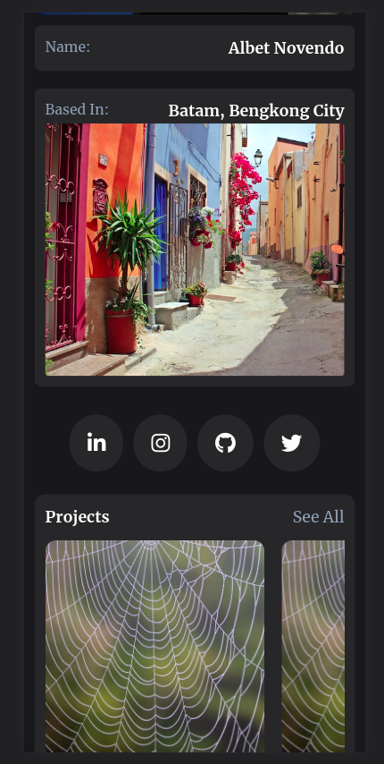
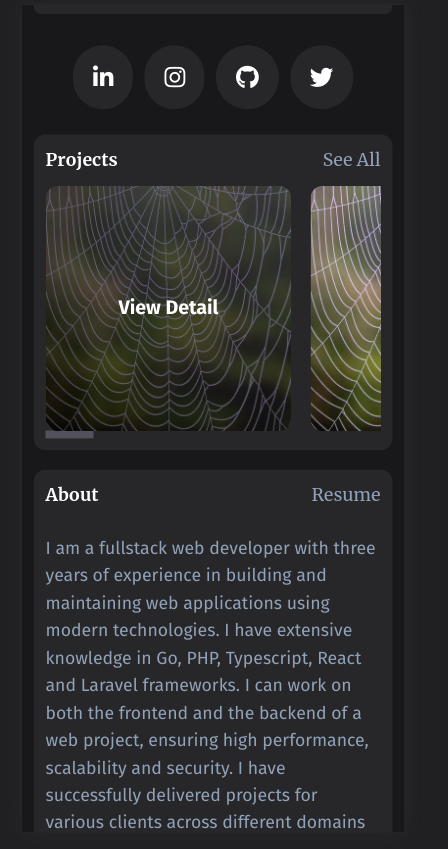
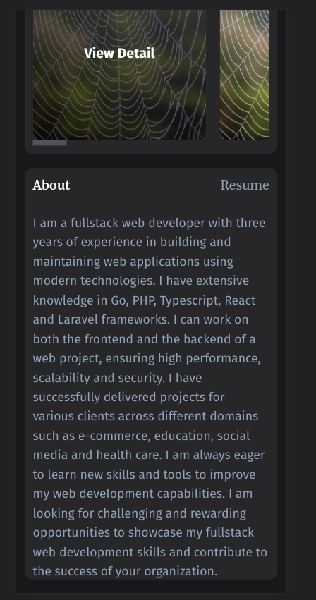

## Portfolio

A simple Portfolio App created in favor of Website Development Assignment

## Installation

### Prerequites

- Composer
- PHP 8.1

### Installing

- type `composer install`
- type `pnpm i` or your preferred package manager

## Running Application

To run the application simply:

- type `php artisan serve`
- at the same time type `pnpm dev` or `npm dev`.

## Screenshots

Here's a few capture of the web app.

